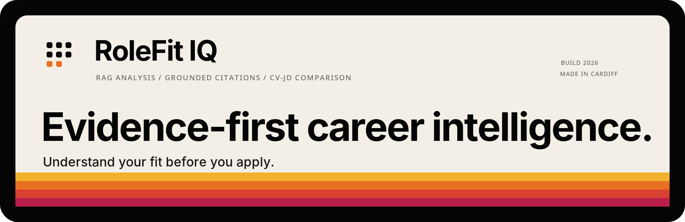
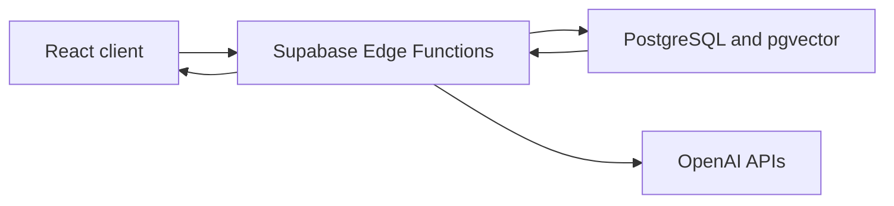

<p align="center">
  
</p>

# RoleFit IQ

**Evidence-first career intelligence for CV-to-role analysis.**

RoleFit IQ is an explainable career intelligence MVP. It compares one CV with up to three job descriptions, surfaces evidence-led fit estimates and gaps, and supports grounded follow-up questions against the uploaded material.

## Core workflow

1. Paste a CV and one to three job descriptions.
2. Validate, chunk, and embed the documents as retrieval evidence.
3. Generate a structured role-fit analysis for each role.
4. Explore strengths, gaps, risks, interview preparation, and score reasoning.
5. Ask grounded questions with evidence citations.

## Core capabilities

- Role-aware document validation and stable job-description slots.
- Evidence indexing with pgvector embeddings.
- Structured fit analysis, score explanation, and rewrite guidance.
- Grounded chat for role fit, gaps, comparison, and interview preparation.
- Session persistence and soft-delete workflow.

## Stack

| Layer | Technology |
| --- | --- |
| Frontend | React, TypeScript, Vite, Tailwind CSS |
| Backend | Supabase Edge Functions, PostgreSQL, pgvector |
| AI | OpenAI embeddings and structured chat completions |
| Data | Sessions, documents, chunks, analyses, chat, and event records |

## Architecture



See the [system overview](docs/architecture/system-overview.md) for the indexing, analysis, and chat flows.

## MVP status and boundaries

Implemented now: plain-text CV/JD input, retrieval-backed chat, structured analysis, soft deletion, and pipeline event records.

MVP limitations: anonymous sessions are not user-owned, processing is synchronous, input is English-oriented, and automated test coverage is not yet present. The migration that restricts public database and RPC access must be applied to the target Supabase project before those protections are active. See the [security model](docs/security/mvp-security-model.md) and [risk register](docs/risks/known-limitations-and-risk-register.md).

## Local setup

```bash
npm install
npm run dev
```

Configure the frontend with `VITE_SUPABASE_URL` and `VITE_SUPABASE_ANON_KEY`. Edge Functions require `SUPABASE_URL`, `SUPABASE_SERVICE_ROLE_KEY`, and `OPENAI_API_KEY` in their runtime environment.

## Validation

```bash
npm run lint
npm run build
```

The current manual QA coverage and future automation path are in [TESTING.md](TESTING.md).

## Documentation

- [Documentation index](docs/index.md)
- [Architecture](docs/architecture/system-overview.md)
- [RAG and LLM approach](docs/ai/rag-and-llm-approach.md)
- [Security model](docs/security/mvp-security-model.md)
- [QA checklist](docs/quality/qa-checklist.md)
- [Productionisation plan](docs/operations/productionisation-plan.md)
- [Demo asset guidance](docs/demo/asset-guidance.md)

## Brand and product identity

RoleFit IQ uses a restrained visual identity inspired by Sony industrial design, Braun minimalism, and modern developer tools. The missing-square mark represents the final fit between a candidate profile and a role.

See [BRAND-GUIDELINES.md](./docs/BRAND-GUIDELINES.md) for the brand system.
