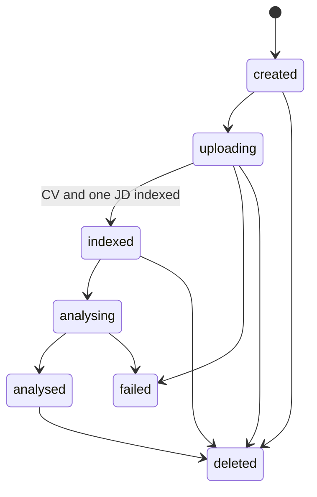

# Data model and lifecycle

## Implemented now

| Record | Responsibility |
| --- | --- |
| `sessions` | Workspace state and lifecycle status. |
| `documents` | CV/JD source text, metadata, parsing/indexing state, and stable slot. |
| `chunks` | Section-aware retrieval units and 1536-dimension embeddings. |
| `analyses` | Structured per-role analysis output and score explanation. |
| `chat_messages` | User and assistant conversation history with citations. |
| `ai_events` | Pipeline events, latency, status, and non-document telemetry. |
| `evaluation_runs` | Per-analysis-run model, status, job count, latency, and error context. |

## Stable document identity

The CV uses slot `cv`; jobs use `jd-01`, `jd-02`, and `jd-03`. Slot IDs are stored on documents, chunks, and analyses so a job retains its identity across retrieval, citations, and UI ordering.

## Lifecycle

Sessions, documents, and chunks are soft-deleted by setting `deleted_at`; the current repository does not implement scheduled hard deletion.

## Retrieval model

`match_chunks` performs cosine-similarity retrieval scoped by session, optional document type, and optional job index. The current restriction migration revokes direct execution for browser roles and grants it to `service_role`; it must be applied to the target Supabase project before this takes effect.

## Production roadmap

- Add authenticated ownership and row-level access policies.
- Define hard-deletion and retention operations.
- Add stronger uniqueness and concurrency constraints where operational scale requires them.
- Move long-running indexing work to a durable background process.
