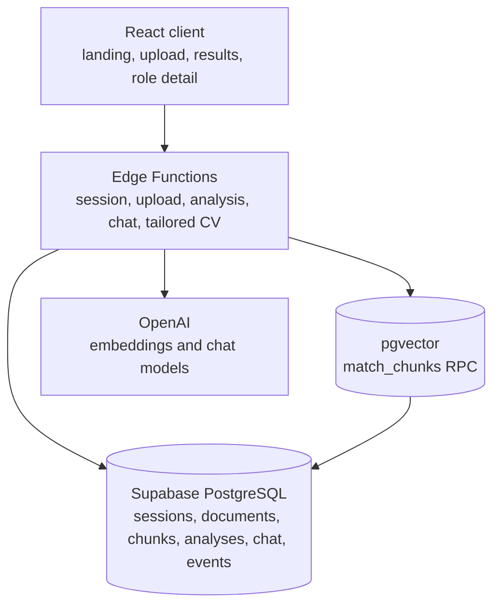
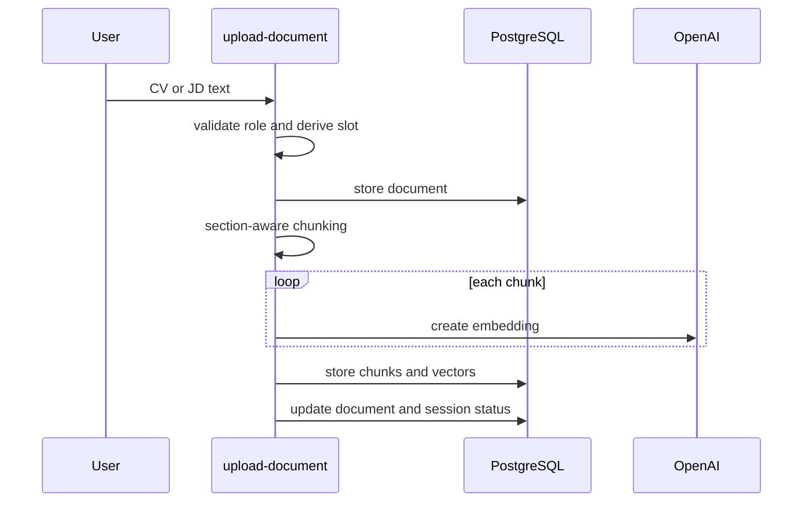
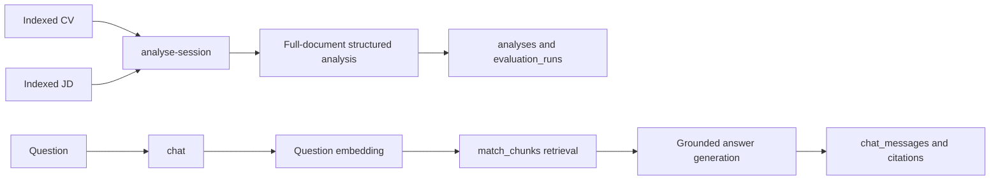

# System overview

## Implemented now

RoleFit IQ is a React client backed by Supabase Edge Functions. Functions use PostgreSQL and pgvector for session data and retrieval evidence, and call OpenAI for embeddings and structured generation.

## Indexing flow

## Analysis and chat paths

## MVP boundary

The application has no conventional backend server: Edge Functions are the application boundary. The current architecture is designed for small session-scoped corpora and synchronous processing. See [data lifecycle](data-model-and-lifecycle.md), [security](../security/mvp-security-model.md), and [productionisation](../operations/productionisation-plan.md) for limitations and next steps.
