# Demo assets and screenshots

I use these captures to show the product workflow and its evidence-first interface. They are drawn from the application and documentation in this repository; they do not imply performance, adoption, or deployment claims.

## Product journey

### 1. Product entry point

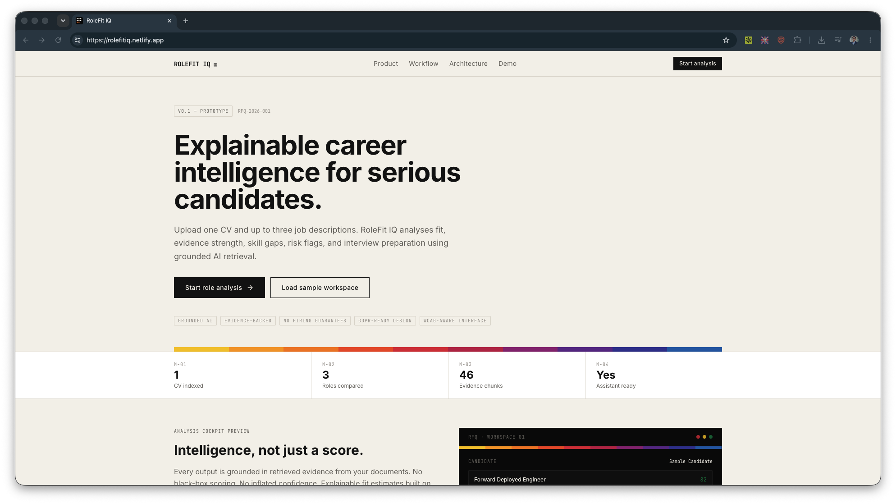

The landing page introduces the evidence-first CV-to-role workflow.

### 2. Loaded workspace

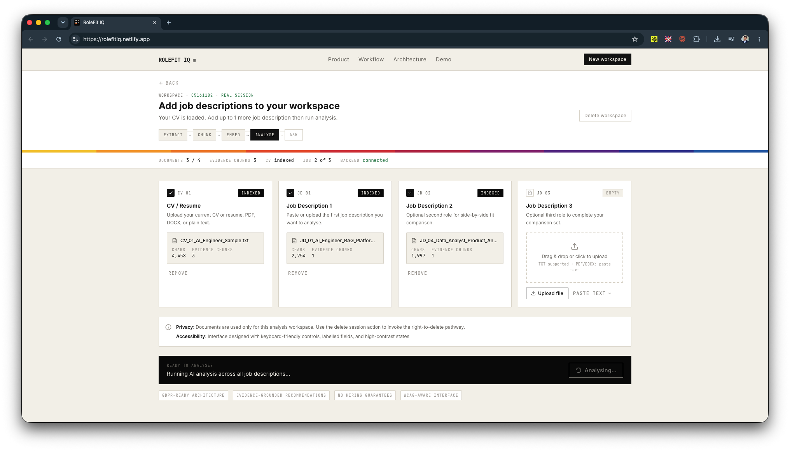

The workspace shows one CV and multiple role inputs ready for analysis.

### 3. Results dashboard

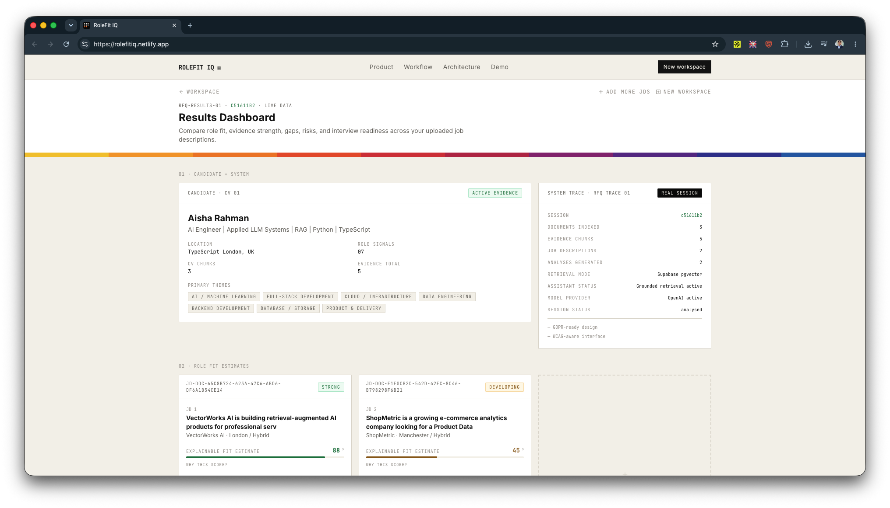

The dashboard brings role summaries, candidate context, and system state into one view.

### 4. Role-fit estimates

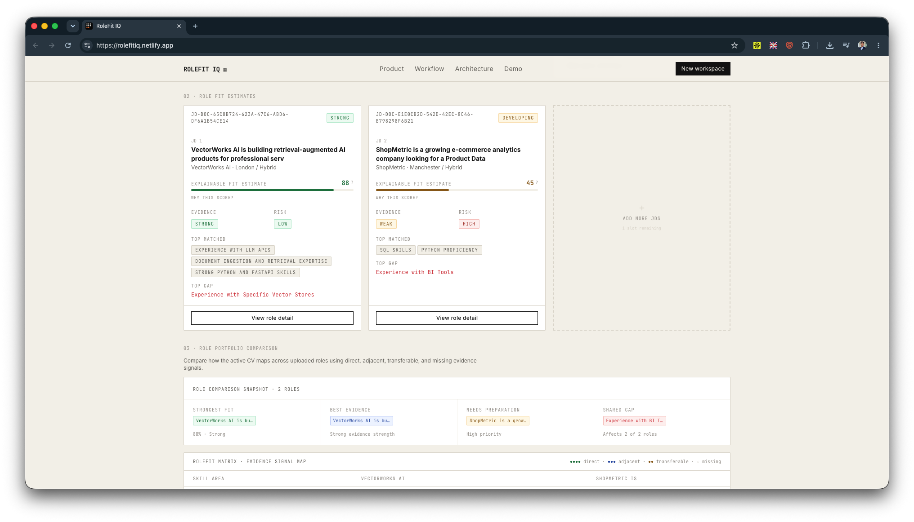

Each role receives an explainable fit estimate with evidence, risk, and preparation signals.

### 5. Score explanation

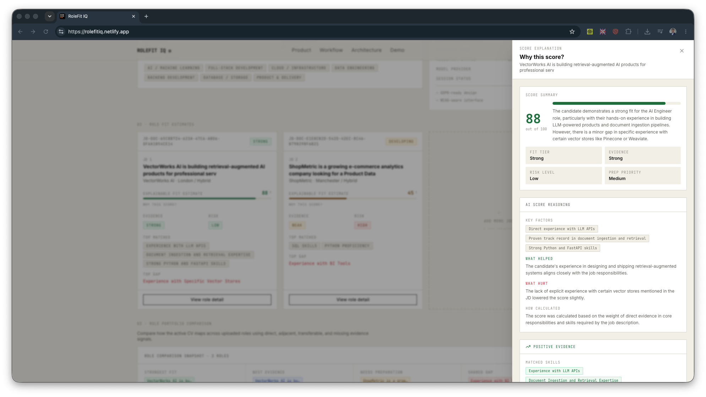

The score explanation links fit reasoning to the evidence and gaps behind it.

### 6. Positive evidence

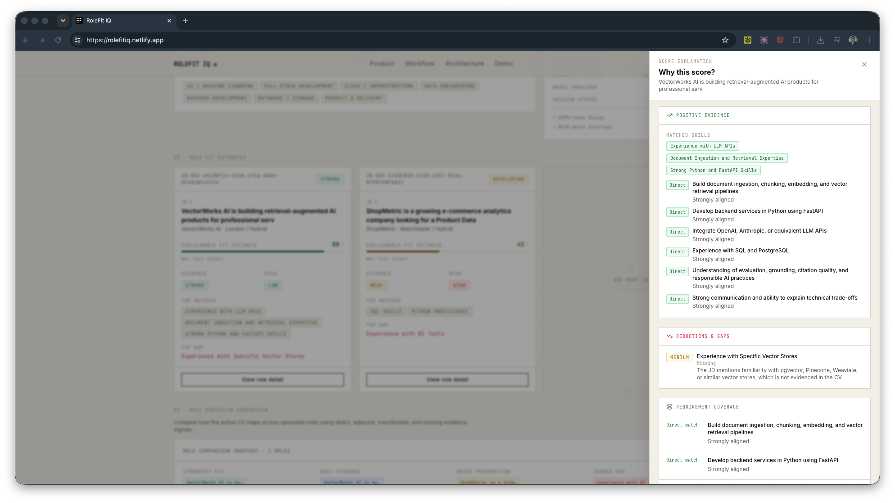

Positive evidence is presented as role-relevant strengths rather than a keyword-only match.

### 7. Requirement coverage

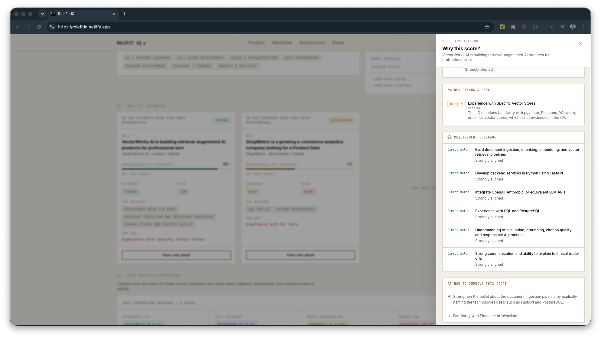

Requirement coverage makes direct, adjacent, transferable, and missing signals easier to inspect.

### 8. Analysis panels

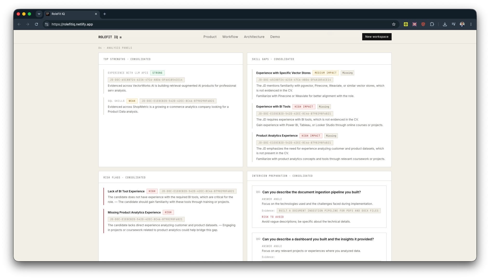

Analysis panels group strengths, gaps, risks, interview preparation, and practical next steps.

### 9. Grounded assistant

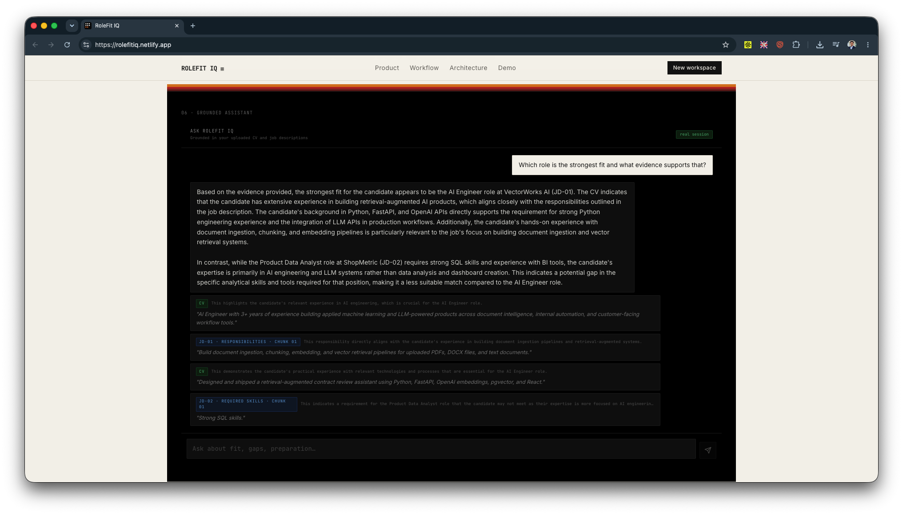

The assistant supports follow-up questions with document-grounded citations.

### 10. Architecture reference

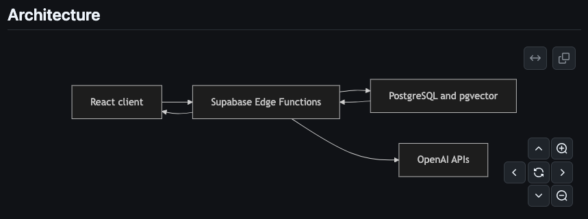

The architecture documentation captures the client, function, data, and model boundaries.

### 11. Brand reference

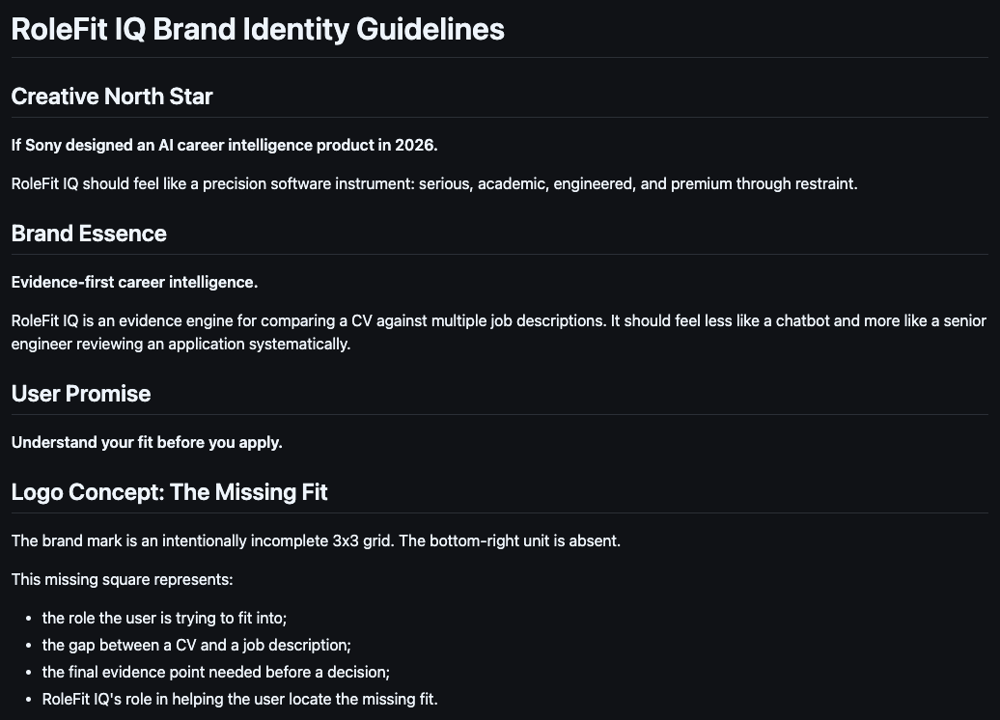

The brand guidance documents the visual system used across the product surface.

## Supporting captures

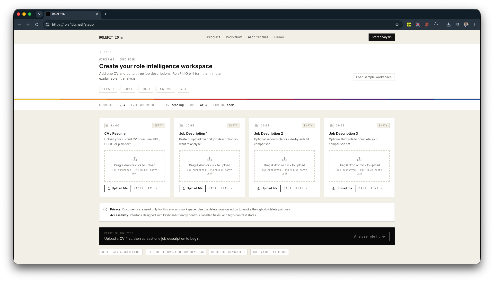

Empty workspace state before documents are added.

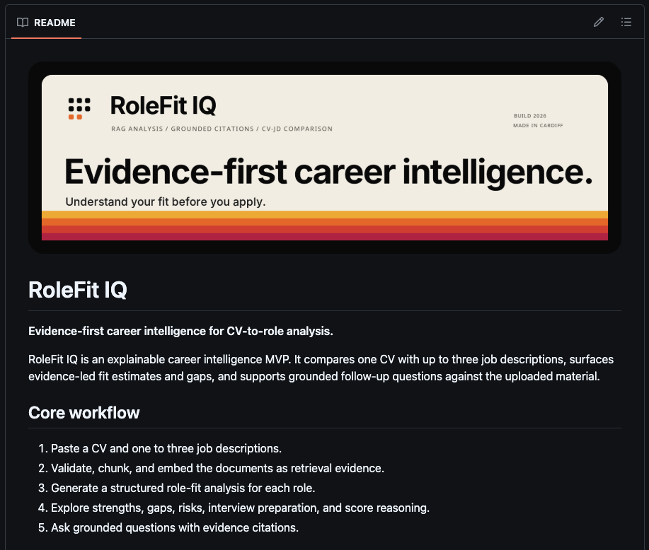

Repository overview and product entry point.

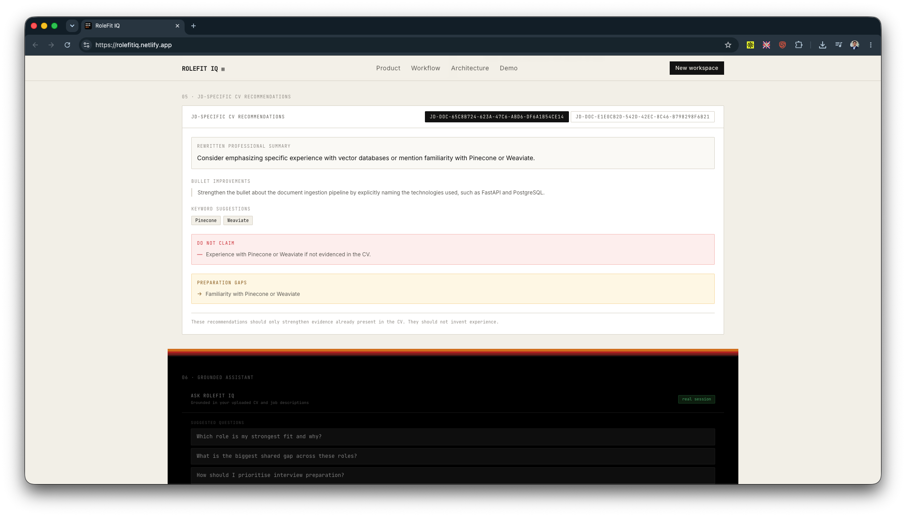

Recommendations scoped to a selected role.

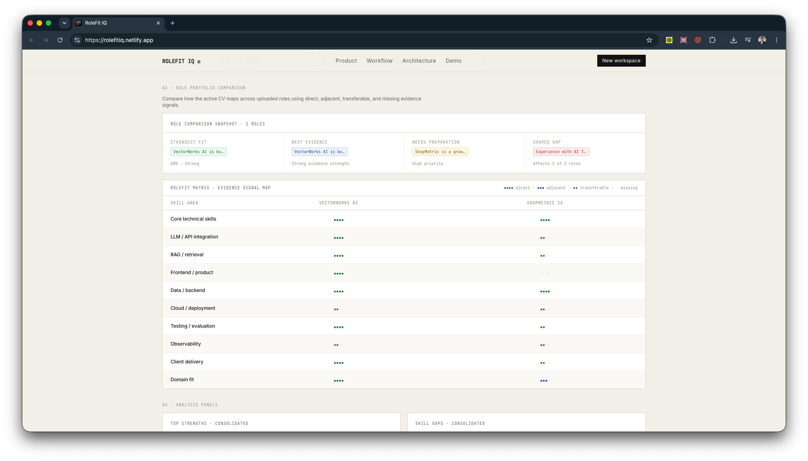

Comparison view for more than one role.

## Asset maintenance

- Keep captures representative of the current product flow.
- Use non-sensitive sample material or material you are permitted to show.
- Update a capture when its corresponding UI or workflow changes.
- Store future approved assets in `public/screenshots/` with descriptive filenames and concise alt text.
