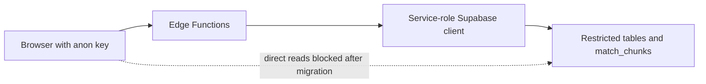

# MVP security model

## Implemented now

- RLS is enabled on the application tables.
- Edge Functions create a Supabase client from `SUPABASE_SERVICE_ROLE_KEY`; the frontend uses the anon key only.
- Sensitive document reads for normal application flows go through Edge Functions.
- Shared responses now return generic messages for 5xx failures and omit 5xx details.
- `test-retrieval` returns `404` unless `ENABLE_TEST_RETRIEVAL=true`.
- An additive migration removes the named public SELECT policies and restricts `match_chunks` execution to `service_role`.

## Required deployment action

The public-data restriction migration is present in the repository but has no effect until it is applied to the target Supabase project. Apply it before relying on the database/RPC restrictions described here.

## MVP limitations

- Session-scoped Edge Functions validate a session UUID and existence, not an authenticated owner.
- There is no user account, user ID, or row ownership model.
- CORS currently permits all origins.
- There is no request rate limit, abuse control, or quota enforcement.
- Soft deletion is implemented, but scheduled hard deletion and a data-subject request workflow are not.
- Function/service credentials and platform configuration are outside this repository's verification boundary.

## Security boundary

## Production roadmap

1. Add Supabase Auth and a `user_id` ownership model.
2. Scope RLS policies and Edge Function queries to the verified caller.
3. Replace wildcard CORS with request-aware, environment-defined allowed origins.
4. Add rate limits, cost controls, monitoring, threat modelling, and security tests.
5. Define retention, hard deletion, incident response, and privacy operations for CV/JD data.
